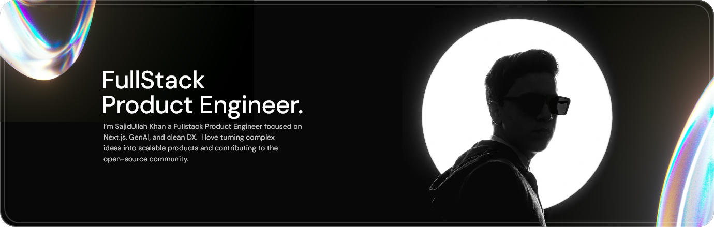

 

- 🔭 I’m a Full-Stack Developer with 3+ years of experience helping startups build scalable web apps.
- 💼 For Clients: I focus on the Build → Launch → Scale methodology. Fast prototypes, clear roadmaps, and high-end UI/UX.
- 🧩 For Devs: I prioritize clean code, reusable components, and an excellent Developer Experience (DX).
- ⚡ My Stack: React, Next.js, Tailwind, TypeScript, Bun/Node, Python, and Flutter.
- 🚀 Check out my featured repos for real-world examples of my work.
- 📫 Let's build something amazing. Reach me at [s5sajidyt@gmail.com](mailto:s5sajidyt@gmail.com) or connect below.

 

<h3 align="center">Connect & Tech</h3>

  
  
  
  

  
  
  
  
  
  

 
